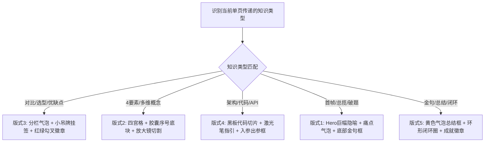

# 海报版式与丰富视觉组件库 (Hand-Drawn Poster Layout Templates & Component Library)

本文档提供 **5 种专为单张手绘科普海报设计的核心版式架构**、**8 大类手绘视觉组件库**以及**知识类型与视觉组件匹配矩阵**。Agent 应根据给定的单项知识主题或段落要点，自动匹配最佳的版式架构与视觉组件组合。

---

## 1. 5 大经典单页手绘科普版式架构 (5 Core Single Poster Layouts)

### 版式 1：Hero 巨幅破题与痛点海报 (Hero Overview & Pain Point Layout)
> 适用于单页涵盖核心概念突破、行业痛点首帧曝光或总揽全局的主题。
```
+------------------------------------------+
|  (顶部巨幅双线手绘泡泡字大标题 + 云朵/气泡) |
| +--------------------------------------+ |
| |  中央大画幅手绘隐喻场景 (主视觉 Hero)  | |
| |  (具象人物/总线/小智与痛点符号重叠)   | |
| +--------------------------------------+ |
|  [小吊牌 1: 痛点A]  [小吊牌 2: 方案B]    |
| +--------------------------------------+ |
| | 底部黄色手绘气泡金句总结框            | |
| +--------------------------------------+ |
+------------------------------------------+
```

### 版式 2：2x2 四宫格高密度干货海报 (2x2 Quad Grid Knowledge Layout)
> 适用于四大要素拆解、4 步法实战、多维指标剖析或四个核心干货点。
```
+------------------------------------------+
|  (顶部双线手绘泡泡字大标题 + 齿轮/涂鸦框)  |
| +--------------------+  +--------------+ |
| |1. 胶囊标题 (概念A)  |  |2. 胶囊标题   | |
| | (放大镜切割细节图) |  |(对比数据/图解)| |
| +--------------------+  +--------------+ |
| +--------------------+  +--------------+ |
| |3. 胶囊标题 (小吊牌) |  |4. 胶囊标题   | |
| | (绳子悬挂吊牌)     |  | (三步法切片) | |
| +--------------------+  +--------------+ |
| (底部黄色手绘气泡金句总结框)              |
+------------------------------------------+
```

### 版式 3：左右分栏对比与降维海报 (Split-Column Contrast Layout)
> 适用于 Pre vs With 方案对比、新旧架构演进、复杂度 M×N vs M+N 降维。
```
+------------------------------------------+
|  (顶部双线手绘大标题: 告别XX噩梦...)     |
| +-------------------+  +---------------+ |
| | [Pre-XX: 警告标]  |  | [With-XX: 勾标]| |
| | (红色杂乱电线网)  |  | (蓝色星型总线)| |
| | 挂3个红色小吊牌   |  | 挂3个绿色吊牌 | |
| +-------------------+  +---------------+ |
| [小智在左侧打叉眼]     [小智在右侧挥扳手]|
| +--------------------------------------+ |
| | 底部黄色手绘气泡金句总结框            | |
| +--------------------------------------+ |
+------------------------------------------+
```

### 版式 4：架构剖面与代码切片流程海报 (Architecture & Code Flow Layout)
> 适用于系统架构层级拆解、黑板代码实战切片、API 4 步调用流程。
```
+------------------------------------------+
|  (顶部双线手绘大标题)                    |
| +--------------------------------------+ |
| | 中央深黑板风格手绘代码/架构切片框     | |
| |  [Step 1: 初始化] -> [Step 2: 挂载]  | |
| |  [Step 3: 响应]   -> [Step 4: 监听]  | |
| +--------------------------------------+ |
|  (手绘放大镜切割图: 展示入参/出参细节)    |
|  [小智戴黄色工程帽，手持红色激光笔手指代码]  |
| (底部 3 个圆形手绘总结成就徽章)          |
+------------------------------------------+
```

### 版式 5：金句速查与生态闭环海报 (Summary & Cheat-Sheet Loop Layout)
> 适用于速查表、生态闭环圈、总结收尾或未来展望。
```
+------------------------------------------+
|  (顶部彩色气泡标题 [SUMMARY / LOOP])    |
|            /-------------\               |
|           / 环形手绘指引线 \              |
|          | 1.环节A -> 2.环节B |            |
|          | 3.环节C -> 4.环节D |            |
|           \---------------/              |
|  +-------------------------------------+ |
|  | 3个圆角虚线框 + 彩色胶囊小标题      | |
|  | 底部黄色手绘气泡金句总结框          | |
|  +-------------------------------------+ |
+------------------------------------------+
```

---

## 2. 8 大类手绘视觉组件库 (Enriched Visual Component Library)

直接在 Prompt 中组合使用以下具体的中文视觉组件词汇：

| 组件分类 | 手绘视觉组件名称 | Prompt 中文词汇 |
| :--- | :--- | :--- |
| **① 标题与容器组件** | **双线泡泡字标题框** | `双线手绘泡泡字大标题框` |
| | **彩色云朵/胶囊底块** | `彩色胶囊小标题底块(1. 2. 3.)` |
| | **圆角虚线卡片框** | `圆角手绘虚线卡片框` |
| | **深色黑板代码框** | `黑板风格手绘代码切片框` |
| **② 逻辑与流转组件** | **手绘弯曲指引箭头** | `蓝色手绘弯曲流程指引箭头` |
| | **中央总线/通道管线** | `手绘中央总线与长连接数据通道` |
| | **环形闭环手绘圆环** | `手绘环形生态循环指引圈` |
| **③ 对比与分类组件** | **分类小吊牌挂签** | `挂在绳子上的彩色小吊牌挂签` |
| | **红绿勾叉对比小徽章**| `带绿色勾与红色叉的手绘对比徽章` |
| | **左右分栏对比气泡** | `左右分栏对比气泡框` |
| **④ 细节与放大组件** | **圆形放大镜细节切割** | `圆形手绘放大镜切割微观细节图` |
| | **剖面解剖椭圆框** | `巨型手绘剖面解剖框` |
| | **文本指引标注线** | `手绘文本指引标注线` |
| **⑤ 警告与提示组件** | **警告感叹号三角徽章** | `黄色/红色手绘警告感叹号三角标` |
| | **人类二次确认弹窗** | `带手绘'Allow'授权按钮的确认弹窗` |
| **⑥ 总结与金句组件** | **黄色手绘气泡总结框** | `底部黄色手绘气泡金句总结框` |
| | **底部圆形总结徽章** | `底部 3 个圆形手绘总结成就徽章` |
| | **进度条与对比标尺** | `手绘对比标尺与百分比进度条` |

---

## 3. 知识类型与视觉组件匹配矩阵 (Knowledge-to-Visual Component Matrix)

Agent 在分析给定知识段落并生成单页海报脚本时，必须根据**知识传递目标**匹配最合适的组件组合：



---

## 4. Prompt 组件组合示例 (双语)

**🔵 中文确认版：**
> `Q版软萌手绘图文科普海报风格，暖米白羊膏纸质感背景。顶部居中是双线手绘泡泡字大标题框，包含 3 个圆角手绘虚线卡片框，带有彩色胶囊小标题底块。画面加入圆形放大镜切割细节图、蓝色手绘弯曲流程指引箭头与 3 个挂在绳子上的彩色小吊牌挂签。底部带有黄色手绘气泡金句总结框。融入可爱极简手绘小机器人小智（Xiao Zhi），具有圆角方块头、单球顶天线、黑色点点眼、一字短线嘴巴，戴着圆形小眼镜拿着手绘放大镜仔细观察右侧卡片的细节数据。莫兰迪配色，黑色软墨勾线，3:4 比例，高清。`

**🟢 英文生图版：**
> `Cute Q-style hand-drawn educational infographic poster, warm off-white cream paper texture background. At the top center, a double-line bubble-lettered title banner, containing 3 rounded-corner dashed-border card frames with colorful capsule header blocks. The image includes a circular magnifying glass detail cutout, blue curved hand-drawn flow arrows, and 3 colorful hanging tag labels on strings. At the bottom, a yellow hand-drawn speech bubble summary box. A cute minimalist hand-drawn robot mascot Xiao Zhi with rounded square head, single ball-top antenna, dot eyes and dash mouth, wearing small round glasses and holding a hand-drawn magnifying glass to carefully examine the detail data in the right-side card. Pastel Morandi colors, soft black ink outlines, 3:4 ratio, high resolution.`
